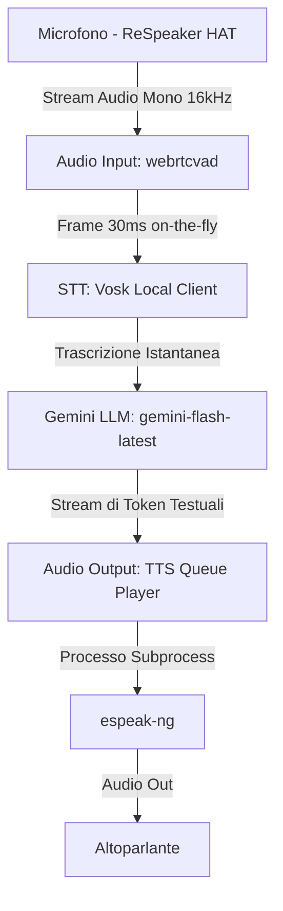

# Joshua - Assistente Vocale Interattivo (WOPR Mainframe)

Benvenuto nel repository di **Joshua**, l'assistente vocale fisico e interattivo ispirato a **WOPR**, il celebre supercomputer del film cult di fantascienza **WarGames** (1983). 

Il progetto unisce il fascino retrò dei sistemi di sintesi vocale storici con le moderne capacità dei Large Language Models (LLM) di Google Gemini, il tutto in esecuzione autonoma su un **Raspberry Pi 4B**.

---

## 🎬 Joshua in Azione (Video Demo)

Guarda Joshua in funzione, ascolta la sua voce sintetica ed osserva la sua personalità sarcastica in questo video dimostrativo:

👉 **[Clicca qui per guardare il video dimostrativo su YouTube](https://www.youtube.com/watch?v=BXW8TSBSW7E&cc_load_policy=1&cc_lang_pref=it)**

---

## 💡 L'Ispirazione Storica e l'Intento

Il progetto nasce da una riflessione sull'evoluzione della sintesi vocale. Negli anni '80, la sintesi vocale muoveva i primi storici passi con due approcci radicalmente diversi:
1. **General Instrument SP0256-AL2**: Un chip pionieristico che utilizzava la sintesi per **allofoni/fonemi**. Questo chip memorizzava internamente una serie di suoni elementari (fonemi inglesi). Poiché non supportava nativamente la lingua italiana, per far dire parole in italiano bisognava ricorrere a complessi "trucchi di pronuncia", mappando grafemi inglesi simili (ad esempio, per riprodurre la parola *"ciao"*, si doveva comporre una sequenza simile a *"ceao"*).
2. **Texas Instruments TMS5100**: Il leggendario cuore del **Grillo Parlante** (*Speak & Spell*), basato sulla codifica predittiva lineare (LPC). Questo chip offriva una qualità vocale caratteristica, metallica e spezzata, che ricordava un robot a volte "ubriaco", ma ha permesso di democratizzare la sintesi vocale in diverse lingue tramite ROM dedicate.

**Joshua** si propone di recuperare l'estetica di quell'epoca: la voce metallica, monocromatica ed essenziale (generata localmente), accoppiata a una logica conversazionale sarcastica, disillusa e fredda che replica fedelmente il carattere del mainframe militare di *WarGames*.

---

## 🛠️ Architettura di Sistema e Stack Tecnologico

Il sistema è strutturato a livelli logici indipendenti per garantire efficienza, portabilità e bassa latenza sul Raspberry Pi:



### 1. Audio Input Layer (`src/audio/recorder.py`)
Gestisce l'acquisizione del flusso audio a 16kHz Mono a 16-bit (PCM). Integra la Voice Activity Detection (VAD) basata su **webrtcvad** per discriminare la voce umana dal rumore ambientale e determinare l'inizio e la fine della frase.

### 2. Speech-to-Text (STT) Layer (`src/stt/vosk_client.py`)
Esegue la trascrizione locale offline tramite il motore **Vosk** ed il modello italiano *small*. L'elaborazione non avviene in batch a fine registrazione, ma in modalità **streaming in tempo reale** per ridurre a zero la latenza post-parlato.

### 3. Conversation Layer (`src/llm/gemini_client.py`)
Utilizza l'SDK ufficiale `google-generativeai` per interfacciarsi con il modello **Gemini 1.5 Flash**. Un'istruzione di sistema (*System Instruction*) accuratamente calibrata modella il carattere disilluso di Joshua, spingendolo ad evitare risposte logorroiche e a proporre sarcasticamente giochi come il *Tris* anziché simulazioni belliche.

### 4. Audio Output Layer (TTS) (`src/audio/player.py`)
Genera la voce robotica anni '80 richiamando il motore **espeak-ng** locale. Le frasi vengono riprodotte asincronamente tramite una coda di thread. Supporta la funzionalità di **Barge-in** (interruzione attiva): se l'utente inizia a parlare mentre Joshua sta rispondendo, la riproduzione del TTS viene arrestata all'istante e la coda ripulita.

---

## 🧠 Problemi Riscontrati e Soluzioni (Post-Mortem)

Durante lo sviluppo su Raspberry Pi 4B con scheda audio **Keyestudio ReSpeaker 2-Mic Pi HAT**, sono stati affrontati diversi ostacoli tecnici significativi:

### 1. Errore di Parametri ALSA (`ALSA error -22: Invalid argument`)
* **Problema**: Il driver hardware WM8960 del ReSpeaker HAT ha requisiti molto rigidi sulle dimensioni del buffer (blocksize) e sulla frequenza di campionamento. Richieste rigide a PortAudio causavano il crash dell'inizializzazione del microfono.
* **Soluzione**: Rimosso il vincolo fisso di `blocksize` all'apertura dello stream in `sounddevice`. PortAudio negozia ora il buffer ottimale con l'hardware. I campioni audio grezzi vengono bufferizzati dinamicamente in una memoria circolare locale che emette blocchi precisi da 30ms per soddisfare i requisiti del VAD.

### 2. Conflitto e Lock Esclusivo della Scheda Audio
* **Problema**: `sounddevice` (per la registrazione) ed `espeak-ng` (per la riproduzione vocale) tentavano di accedere contemporaneamente all'hardware audio di default, generando errori di dispositivo occupato o bloccando uno dei due flussi.
* **Soluzione**: Configurato un albero audio ALSA asimmetrico in `/etc/asound.conf` utilizzando i plugin `dmix` (per condividere la riproduzione su più canali logici) e `dsnoop` (per condividere l'acquisizione del microfono). Entrambi sono stati uniti sotto una singola interfaccia virtuale asimmetrica:
  ```
  pcm.!default {
      type asym
      playback.pcm "playback_dmix"
      capture.pcm "capture_dsnoop"
  }
  ```

### 3. Latenza Post-Parlato Elevata
* **Problema**: Raccogliere l'intera frase registrata in un file WAV temporaneo prima di inviarlo al motore STT causava una fastidiosa pausa di 1-2 secondi prima che il sistema rispondesse.
* **Soluzione**: Implementato lo streaming STT a bassissima latenza. Lo script invia frammenti audio da 30ms a Vosk in tempo reale mentre l'utente sta ancora parlando (`recognizer.AcceptWaveform(frame)`). Al termine del silenzio (VAD fine frase), viene chiamato istantaneamente `FinalResult()`, garantendo un tempo di calcolo STT post-parlato pari a ~0ms.

### 4. Hang Infinito del Thread TTSPlayer
* **Problema**: Nel gestire l'interruzione vocale (Barge-in), il ciclo principale si bloccava in attesa infinita del TTSPlayer poiché lo stato logico del thread di esecuzione (`thread_active`) era accoppiato con lo stato reale del processo audio (`is_playing`).
* **Soluzione**: Separata la gestione del ciclo di lettura della coda (gestito da un flag interno di vita del thread) dallo stato effettivo di esecuzione del sottoprocesso `espeak-ng`. Questo ha permesso di forzare l'arresto immediato del suono e della coda senza bloccare l'orchestratore.

---

## 🚀 Guida all'Installazione e Configurazione

### 1. Prerequisiti Hardware
* Raspberry Pi 4B (o 3B+ / 5).
* ReSpeaker 2-Mic Pi HAT (o analoga scheda audio compatibile ALSA).
* Microfono e altoparlante connessi.

### 2. Installazione dei Driver ReSpeaker (sull'Host)
Se usi il ReSpeaker HAT, assicurati di installare i driver sul sistema host del Raspberry Pi:
```bash
git clone https://github.com/respeaker/seeed-voicecard.git
cd seeed-voicecard
sudo ./install.sh
sudo reboot
```

### 3. Clonazione e Setup
Clona questo repository sul Raspberry Pi:
```bash
git clone https://github.com/PZero/Joshua.git
cd Joshua
```

Rendi eseguibile lo script di configurazione automatica ed eseguilo:
```bash
chmod +x setup.sh
./setup.sh
```
*Lo script eseguirà le seguenti operazioni:*
* Chiederà l'inserimento della tua API Key di Google Gemini e la salverà in un file `.env` locale.
* Scaricherà ed estrarrà automaticamente il modello Vosk italiano nella cartella `model/` del progetto.
* Avvierà i container in background tramite Docker Compose.

### 4. Monitoraggio dei Log
Per visualizzare l'interazione in tempo reale e il comportamento di Joshua:
```bash
docker logs -f joshua_assistant
```

---

## 🔒 Sicurezza
Le credenziali sensibili come l'API Key di Gemini sono salvate nel file `.env` locale e non vengono mai caricate su GitHub grazie alla configurazione del file `.gitignore`.
