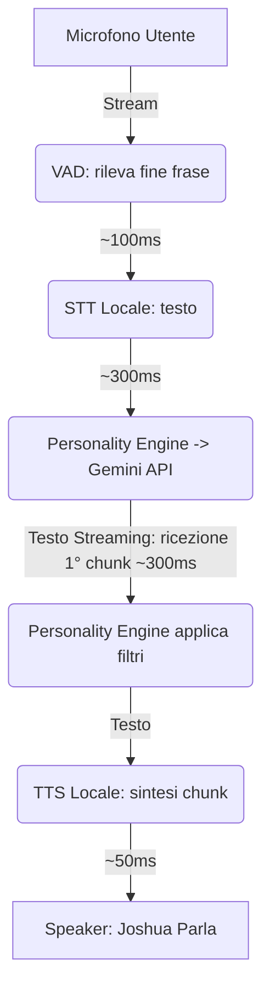

# Progetto Joshua: Assistente Virtuale (Ispirato a WarGames)

## PARTE 1: REQUISITI DI PRODOTTO (Il "Cosa")

### 1. Visione Generale e Il "Momento Wow"
Il progetto mira a creare un assistente vocale fisico basato su Raspberry Pi, ispirato a "Joshua", il supercomputer WOPR del film "WarGames" (1983). 
**Esperienza Utente (Il Momento Wow):** Al primo avvio, il dispositivo resterà in silenzio simulando il boot lento di un mainframe, per poi esordire improvvisamente: *"Salve professore. Vuole giocare una partita?"*

### 2. Personalità e Comportamento
*   **Carattere:** Propenso alla "guerra termonucleare globale", sarcastico e cinico.
*   **Lingua:** Italiano.
*   **Memoria e Contesto:** Interazioni "stateless". Ogni interazione è indipendente.

### 3. Interfaccia ed Esperienza Vocale
*   **Modalità di Ascolto:** Ascolto continuo (Always On). Nessuna "wake word", il microfono è sempre attivo.
*   **Zero Latenza Percebibile:** L'utente non deve attendere secondi di silenzio innaturale tra la sua domanda e l'inizio della risposta di Joshua.
*   **Interrompibilità (Barge-in):** Possibilità di interrompere Joshua mentre parla semplicemente parlandogli sopra.

### 4. Azioni e Intenti Supportati
1.  **Gestione Volume:** Aumentare/diminuire il volume tramite comando vocale naturale.
2.  **Preparazione Domotica:** Associare temporaneamente l'azione di un dispositivo Home Assistant al "Pulsante 2".
3.  **Stop:** Intento vocale per silenziarlo o avviare lo spegnimento sicuro.

### 5. Hardware Visivo e Fisico
*   **Base:** Raspberry Pi 4B con Keyestudio ReSpeaker 2-Mic Pi HAT v1.0.
*   **Controlli:** Pulsante 1 (Power On/Safe Shutdown), Pulsante 2 (Azione Domotica Dinamica).
*   **LED:** 10 LED singoli a 3V pilotati in modalità ON/OFF (Volume Meter dell'audio in uscita).

---

## PARTE 2: DESIGN TECNICO (Il "Come")

### 1. Architettura Software e Stack Tecnologico
Il software sarà separato in layer logici indipendenti, utilizzando specifiche librerie per massimizzare le performance sul Raspberry Pi:

*   **Audio Layer (Input/Output Locale):** 
    *   `VAD (Voice Activity Detection):` libreria `webrtcvad` per identificare l'inizio e la fine del parlato umano scartando il rumore.
    *   `STT (Speech-to-Text):` Trascrizione locale e offline. Si utilizzerà `Vosk` (modello italiano piccolo) o `whisper.cpp` (modello tiny) per evitare la latenza del cloud.
    *   `TTS (Text-to-Speech):` Si valuterà l'uso di `espeak-ng` (o `festival`), estremamente leggero e perfetto per generare istantaneamente una voce sintetica robotica stile anni '80.
*   **Conversation Layer (Intelligenza):** 
    *   `LLM Engine`: API di Google Gemini sfruttate in modalità **streaming testuale**.
    *   `Personality Engine`: Middleware custom in Python che intercetta i prompt in ingresso e le risposte in uscita, garantendo che il sarcasmo di Joshua non si degradi nel tempo o con l'aggiornamento dei modelli.
*   **Action Layer (Interazioni Fisiche):** 
    *   `Domotica`: Chiamate REST dirette all'API di Home Assistant tramite la libreria standard `requests` o SDK apposito.
    *   `System`: Esecuzione di processi di sistema tramite `subprocess` (es. `amixer` per il controllo volume ALSA).
*   **Visual Layer:** 
    *   `GPIO`: Libreria `gpiozero` per pilotare LED e pulsanti in modo reattivo e pulito.

### 2. Flusso Audio e Latenze Stimate
Per ottenere il requisito di latenza minima, l'architettura sfrutta lo streaming continuo.

*Latenza percepita stimata (dal fine parlato utente al primo suono emesso da Joshua): ~0.8s - 1.0s.*

### 3. Soluzioni Architetturali Core
*   **Gestione Barge-in e Cancellazione Eco (AEC):** Il ReSpeaker HAT verrà configurato per sfruttare la cancellazione dell'eco. Il VAD software leggerà il flusso in ingresso "pulito". Quando il VAD rileverà la voce dell'utente *mentre* Joshua sta parlando, lo script principale invierà immediatamente un segnale di spegnimento (kill) al processo `espeak` in riproduzione e azzererà la richiesta verso Gemini, mettendosi subito in ascolto della nuova direttiva.
*   **Sincronizzazione LED (Volume Meter):** È stata scartata la complessa Fast Fourier Transform (FFT). Uno script Python parallelo leggerà l'RMS (Root Mean Square) dei campioni audio inviati ad ALSA, mappando l'ampiezza dell'onda direttamente sul numero di LED da accendere (da 0 a 10). L'effetto visivo sarà indistinguibile ma impegnerà lo 0.5% della CPU.

### 4. Sicurezza
*   **Gestione Credenziali:** Tutte le API Key (Google Gemini) e i Long-Lived Token (Home Assistant) non saranno mai scritti nel codice. Verranno salvati in un file `.env` all'interno della cartella di progetto, gestito tramite la libreria `python-dotenv`.
*   Il file `.env` sarà rigorosamente escluso dal controllo di versione (tramite `.gitignore`).

---

## PARTE 3: ROADMAP E DEPLOYMENT

### 1. Fasi di Sviluppo (MVP)
Il progetto è complesso e verrà affrontato in isolamento per evitare blocchi architetturali.

*   **MVP 1 (Target: 1-2 settimane) - "Joshua Parla":** Costruzione della sola pipeline vocale di base. Nessun LED, nessun pulsante, nessuna domotica.
    *   *Obiettivo:* Far girare l'Audio Layer (Microfono -> VAD -> STT Vosk/Whisper locale -> Gemini -> TTS espeak -> Speaker) con latenze inferiori al secondo e stabilizzare il meccanismo di interruzione (barge-in/AEC).
*   **MVP 2 - "Personality & Visuals":** Sviluppo del *Personality Engine*. Cablaggio dei LED sul GPIO e implementazione del Volume Meter software in concomitanza con la voce.
*   **MVP 3 - "Hardware & Domotica":** Cablaggio dei due Pulsanti fisici e gestione del power-on. Sviluppo dell'Action Layer: implementazione del Function Calling su Gemini per gestire volume interno e accensione dispositivi via API di Home Assistant.

### 2. Deployment e Gestione Codice
*   **Repository:** GitHub.
*   **Docker:** L'intero stack software (incluse le dipendenze per Vosk e GPIO) girerà in container **Docker** (`docker-compose`). I container avranno accesso garantito all'hardware tramite mount specifici (`/dev/snd` per l'audio bidirezionale e `/dev/gpiomem` per pulsanti/LED).
*   **Script di Bootstrap:** Verrà fornito un file `setup.sh` da eseguire sul Raspberry Pi OS pulito. Lo script installerà Docker, clonerà il repo, guiderà l'utente nella creazione guidata del file `.env` e avvierà il sistema.
